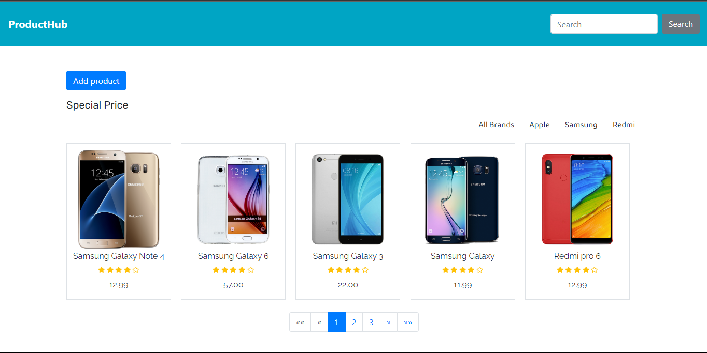
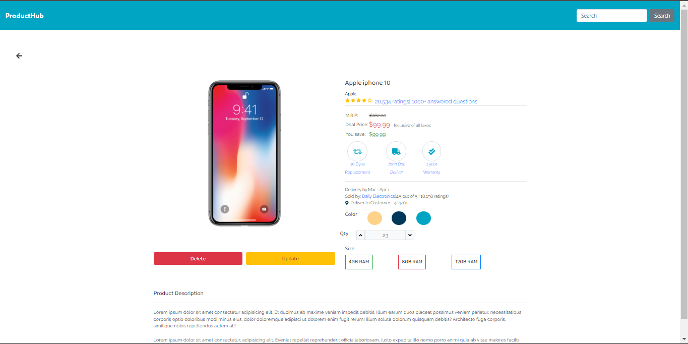
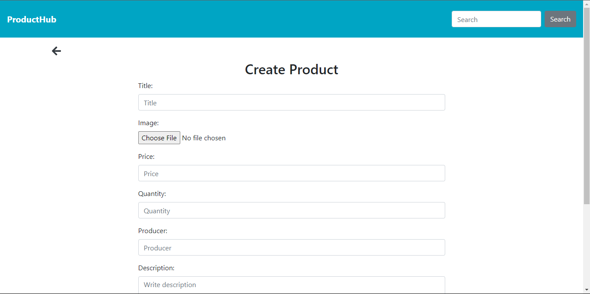
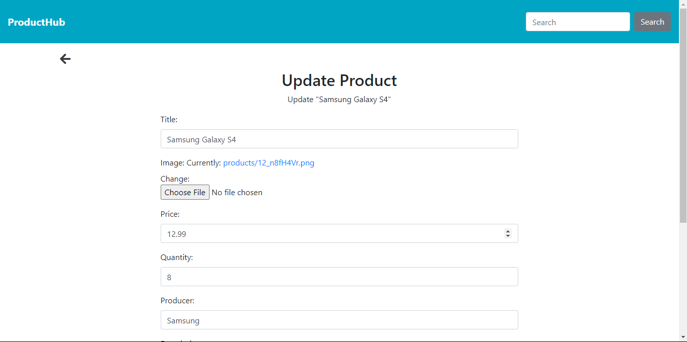
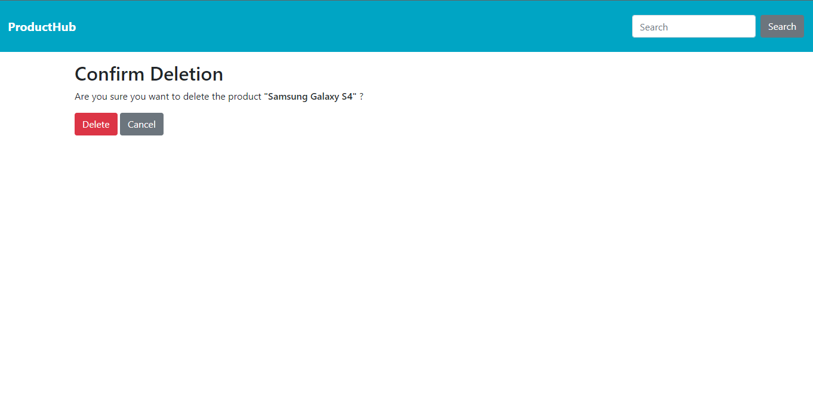

# ProductHub

ProductHub is a Django-based web application that stores and manages mobile phones as products. This project includes functionalities such as CRUD operations, search, pagination, file upload, and template integration.

## Features

1. **CRUD Application**: Create, Read, Update, and Delete operations for managing products.
2. **Search Functionality**: Allows users to search for products.
3. **Pagination**: Efficiently handles the display of products across multiple pages.
4. **Django Message Framework**: Provides user feedback via messages.
5. **Pagination with Search**: Pagination works in sync with search functionality.
6. **File Upload & Management**: Allows users to upload and manage files related to products.
7. **Template Connection**: Utilizes Django templates for rendering pages.
8. **Isotope.js Filtering**: Filter products by their producers or make using Isotope.js for a dynamic and interactive product display.


## Screenshots

 
## Installation

Follow these steps to get a copy of the project running on your local machine.

### Prerequisites

- Python 3.x
- Pipenv (for managing virtual environments and dependencies)

### Setup

1. **Clone the repository:**

    ```bash
    git clone https://github.com/meenphilip/productHub.git
    ```

2. **Install dependencies:**

    Using `Pipenv`:

    ```bash
    pipenv install
    ```

    Alternatively, you can use `pip` with the provided `requirements.txt` file:

    ```bash
    pip install -r requirements.txt
    ```

3. **Set up the database:**

    Apply the migrations:

    ```bash
    python manage.py migrate
    ```

4. **Create a superuser:**

    ```bash
    python manage.py createsuperuser
    ```

    Follow the prompts to create a superuser account.

5. **Run the development server:**

    ```bash
    python manage.py runserver
    ```

6. **Access the application:**

    Open your web browser and go to `http://127.0.0.1:8000/`.

## Usage

- **CRUD Operations**: Add, view, edit, and delete products.
- **Search**: Use the search bar to find specific products.
- **Pagination**: Navigate through product pages using the pagination controls.
- **File Upload**: Upload images and files related to products.

## Screenshots

| Product List | Product Detail | Product Create |
|--------------|----------------|----------------|
|  |  |  |

| Product Update | Product Delete |
|----------------|----------------|
|  |  |
